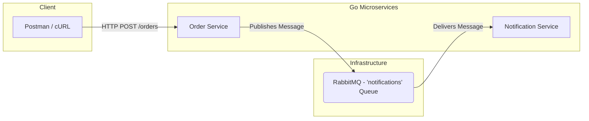

[Read the Portuguese version](README.pt-br.md)

# PoC - Microservices with Go, RabbitMQ, Kafka, and Kubernetes

This repository contains the source code for a Proof of Concept (PoC) developed as a hands-on study of Go (Golang) applied to a microservices architecture. The goal is to simulate a real-world environment, covering essential concepts to prepare for backend technical interviews.

## 🎯 Objective

The main objective of this PoC is to build a distributed system step-by-step, exploring:
- The creation of microservices in Go.
- Asynchronous communication patterns (Message Queues and Event Streaming).
- Containerizing Go applications with Docker.
- Orchestrating containers in a simulated production environment with Kubernetes.

## 🏛️ Architecture (Phase 2)

In the current phase, the architecture consists of two microservices that communicate asynchronously via RabbitMQ.



1.  **Order Service (`servico-de-pedidos`):** A REST API that receives requests to create new orders. After processing an order, it publishes a message to a RabbitMQ queue.
2.  **Notification Service (`servico-de-notificacao`):** Listens to the `notifications` queue in RabbitMQ. When a message is received, it processes it (currently, it just prints a log).

## 🛠️ Tech Stack

- **Go (Golang):** The language used to build all microservices, chosen for its performance, simplicity, and strong support for concurrency.
- **RabbitMQ:** The message broker used for asynchronous, queue-based communication (Producer/Consumer pattern).
- **Docker:** Used to run the infrastructure (RabbitMQ) in an isolated and standardized way.
- **Go Modules:** `github.com/rabbitmq/amqp091-go` for RabbitMQ integration.

### Planned for the next phases:
- **Kafka:** An event streaming platform for an event-driven architecture.
- **Kubernetes:** A container orchestrator for deploying and managing the application in a scalable environment.

## 🚀 How to Run the Project (As of Phase 2)

Follow the steps below to run the application in your local environment.

### Prerequisites
- **Go** (version 1.18 or higher) installed.
- **Docker** installed and running.

### 1. Clone the Repository
```bash
git clone https://github.com/felipedmsantos95/go-microservices-poc
cd go-poc-microsservicos
```

### 2. Start the Infrastructure (RabbitMQ)
Run the command below to start a RabbitMQ container.
```bash
docker run -d --name rabbitmq -p 5672:5672 -p 15672:15672 rabbitmq:3-management
```
> You can access the RabbitMQ management UI at `http://localhost:15672` (user: `guest`, password: `guest`).

### 3. Run the Notification Service
Open a **new terminal** and run the following commands:
```bash
cd notification-service
go run main.go
```
> You will see the message: `[*] Waiting for messages. To exit press CTRL+C`

### 4. Run the Order Service
Open a **second terminal** and run the following commands:
```bash
cd orders-service
go run main.go
```
> You will see the message: `Started server on :3000`

### 5. Test the Application
Send a POST request to the order service using cURL or a tool like Postman.

```bash
curl -X POST http://localhost:8080/orders \
-H "Content-Type: application/json" \
-d '{
    "product": "Kubernetes Course",
    "quantity": 1
}'
```

### 6. Check the Result
- In the **order service** terminal, you will see a log confirming the order was received and the message was published.
- In the **notification service** terminal, you will see a log confirming the message was received from the queue.

## 📈 Next Steps
- [ ] **Phase 3:** Integrate Kafka to create an event-driven `analytics-service`.
- [ ] **Phase 4:** Create `Dockerfiles` to containerize the Go services.
- [ ] **Phase 5:** Deploy the entire architecture to Kubernetes.