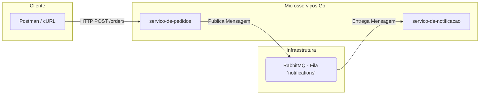

# POC - Microsserviços com Go, RabbitMQ, Kafka e Kubernetes

Este repositório contém o código-fonte de uma Prova de Conceito (PoC) desenvolvida como um estudo prático de Go (Golang) aplicado a uma arquitetura de microsserviços. O objetivo é simular um ambiente real, abordando conceitos essenciais para preparação para entrevistas técnicas de backend.

## 🎯 Objetivo

O principal objetivo desta PoC é construir um sistema distribuído passo a passo, explorando:
- A criação de microsserviços em Go.
- Padrões de comunicação assíncrona (Filas de Mensagens e Streaming de Eventos).
- Containerização de aplicações Go com Docker.
- Orquestração de contêineres em um ambiente de produção simulado com Kubernetes.

## 🏛️ Arquitetura (Fase 2)

Na fase atual, a arquitetura é composta por dois microsserviços que se comunicam de forma assíncrona através do RabbitMQ.



1.  **Serviço de Pedidos (`servico-de-pedidos`):** Uma API REST que recebe requisições para criar novos pedidos. Após processar um pedido, ele publica uma mensagem em uma fila do RabbitMQ.
2.  **Serviço de Notificação (`servico-de-notificacao`):** Ouve a fila `notifications` no RabbitMQ. Ao receber uma mensagem, ele a processa (atualmente, apenas exibe um log).

## 🛠️ Tecnologias Utilizadas

- **Go (Golang):** Linguagem utilizada para a construção de todos os microsserviços, valorizando a performance, simplicidade e o forte suporte à concorrência.
- **RabbitMQ:** Message Broker utilizado para a comunicação assíncrona baseada em filas (padrão Produtor/Consumidor).
- **Docker:** Utilizado para executar a infraestrutura (RabbitMQ) de forma isolada e padronizada.
- **Módulos Go:** `github.com/rabbitmq/amqp091-go` para a integração com o RabbitMQ.

### Planejado para as próximas fases:
- **Kafka:** Plataforma de streaming de eventos para uma arquitetura orientada a eventos.
- **Kubernetes:** Orquestrador de contêineres para a implantação e gerenciamento da aplicação em um ambiente escalável.

## 🚀 Como Executar o Projeto (Até a Fase 2)

Siga os passos abaixo para executar a aplicação em seu ambiente local.

### Pré-requisitos
- **Go** (versão 1.18 ou superior) instalado.
- **Docker** instalado e em execução.

### 1. Clonar o Repositório
```bash
git clone https://github.com/felipedmsantos95/go-microservices-poc
cd go-poc-microsservicos
```

### 2. Iniciar a Infraestrutura (RabbitMQ)
Execute o comando abaixo para iniciar um contêiner Docker com o RabbitMQ.
```bash
docker run -d --name rabbitmq -p 5672:5672 -p 15672:15672 rabbitmq:3-management
```
> Você pode acessar a interface de gerenciamento do RabbitMQ em `http://localhost:15672` (usuário: `guest`, senha: `guest`).

### 3. Executar o Serviço de Notificação
Abra um **novo terminal** e execute os seguintes comandos:
```bash
cd servico-de-notificacao
go run main.go
```
> Você verá a mensagem: `Serviço de Notificação iniciado. Aguardando por mensagens...`

### 4. Executar o Serviço de Pedidos
Abra um **segundo terminal** e execute os seguintes comandos:
```bash
cd servico-de-pedidos
go run main.go
```
> Você verá a mensagem: `Servidor de Pedidos iniciado na porta 8080`

### 5. Testar a Aplicação
Envie uma requisição POST para o serviço de pedidos usando cURL ou uma ferramenta como o Postman.

```bash
curl -X POST http://localhost:8080/orders \
-H "Content-Type: application/json" \
-d '{
    "product": "Curso de Kubernetes",
    "quantity": 1
}'
```

### 6. Verificar o Resultado
- No terminal do **serviço de pedidos**, você verá um log confirmando o recebimento do pedido e a publicação da mensagem.
- No terminal do **serviço de notificação**, você verá um log confirmando o recebimento da mensagem da fila.

## 📈 Próximos Passos
- [ ] **Fase 3:** Integrar o Kafka para criar um `servico-de-analise` orientado a eventos.
- [ ] **Fase 4:** Criar `Dockerfiles` para containerizar os serviços Go.
- [ ] **Fase 5:** Implantar toda a arquitetura no Kubernetes.